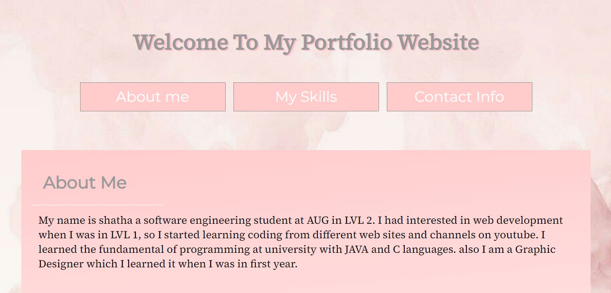
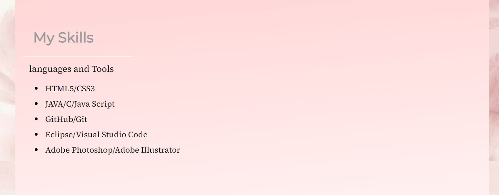

## portfolio-project-sh

## You can check it out [Here](https://gsg-cf05.github.io/portfolio-project-sh/)

## Why did I create this website?
This website contains information about me as a portfolio. To put it in my Github and send the website 
to different clients.

## What is portfolio website?
website holds information about me contains 3 section. The name of the first one is About Me which contains 
description about my self and what i am doing or studying. The second one is Skills contains programming languages that I studied and tools. The third one is Contact Info.

## How did I create it?
*HTML5 and CSS3
*GitHub and Git 
*Visual Studio Code

BY: [Shatha k. Eqdaih](https://github.com/shathakh)

## Final Result

